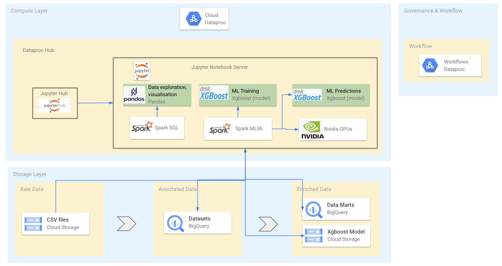

# Welcome to the Datalake Demo 

Copyright 2020 Google LLC
Licensed under the Apache License, Version 2.0 (the "License");
you may not use this file except in compliance with the License.
You may obtain a copy of the License at
    https://www.apache.org/licenses/LICENSE-2.0
Unless required by applicable law or agreed to in writing, software
distributed under the License is distributed on an "AS IS" BASIS,
WITHOUT WARRANTIES OR CONDITIONS OF ANY KIND, either express or implied.
See the License for the specific language governing permissions and
limitations under the License.

Apache Spark on Dataproc - Bank Marketing Demo
Demo video link - https://www.youtube.com/watch?v=RbLOi1Cgsmo&feature=emb_title

Apache Spark on Dataproc - Bank Marketing Demo

Apache Spark on Dataproc provides features to allow you to build an end to end solution for a wide number of use cases. This demo notebook focuses on using data from a financial services company who can build a data lake on Google Cloud and show how data enginers, data analysts and data scientists can use Apache Spark can work together to build a model to predict if a customer campaign will result in a deposit being made.

This notebook can be easily adapted to show to build a model to predict if a loan should be approved as shown in the video above.

1. Set-up Data Lake and Dataproc
This demo is designed to be run on Google Cloud Dataproc. Follow these steps to create create a Dataproc Cluster and then copy the notebook to your notebooks folder.

These steps should be run in the Google Cloud Shell

1.1 - Set env configuration
export REGION=us-central1
export PROJECT_ID=<project-id>
1.2 - Create GCS bucket
GCS bucket for Dataproc Clusters and Hive Warehouse
export BUCKET_NAME=${PROJECT_ID}-demo

gsutil mb -l ${REGION} gs://${BUCKET_NAME}
1.3 - Create a Hive Metastore
Note: Dataproc Metastore is now available in private Alpha. This section can be replaced with Dataproc Metastore if you have access

1.3.1. Create a Hive Cloud SQL database
gcloud sql instances create hive-metastore-db \
    --database-version="MYSQL_5_7" \
    --activation-policy=ALWAYS \
    --region ${REGION}
1.3.2. Create a Hive Metastore Dataproc Cluster
Once the Cloud SQL instance is created create a new Dataproc hive metastore cluster that connects to the cluster.

gcloud dataproc clusters create hive-cluster \
    --async \
    --scopes sql-admin \
    --image-version 1.5 \
    --region ${REGION} \
    --initialization-actions gs://goog-dataproc-initialization-actions-${REGION}/cloud-sql-proxy/cloud-sql-proxy.sh \
    --properties hive:hive.metastore.warehouse.dir=gs://${BUCKET_NAME}/hive-warehouse \
    --metadata "hive-metastore-instance=${PROJECT_ID}:${REGION}:hive-metastore-db"
1.4 - Create Dataproc cluster with Jupyter, Rapids and GPUs
1.4.1. Create Cluster
export CLUSTER_NAME=jupyter-gpu-cluster
export NUM_GPUS=2
export NUM_WORKERS=2

gcloud dataproc clusters create $CLUSTER_NAME  \
    --region $REGION \
    --image-version=preview-ubuntu \
    --master-machine-type n1-standard-4 \
    --num-workers $NUM_WORKERS \
    --worker-accelerator type=nvidia-tesla-t4,count=$NUM_GPUS \
    --worker-machine-type n1-highmem-4\
    --initialization-actions gs://goog-dataproc-initialization-actions-${REGION}/gpu/install_gpu_driver.sh,gs://goog-dataproc-initialization-actions-${REGION}/rapids/rapids.sh \
    --optional-components=ANACONDA,JUPYTER \
    --metadata gpu-driver-provider="NVIDIA" \
    --metadata rapids-runtime=SPARK \
    --scopes https://www.googleapis.com/auth/cloud-platform \
    --bucket $BUCKET_NAME \
    --enable-component-gateway \
    --properties="^#^spark:spark.yarn.unmanagedAM.enabled=false"
1.5 - Go to JupyterLab and copy this notebook
Once your cluster is ready go follow these steps to copy this notebook:

On the Dataproc cluster UI go to web interfaces tab
Cick on the link to open JupyterLab.
Go the Local Disk folder in JupyterLab
Click on the plus (+) button to open the launcher
Open terminal and run the cmd below to copy the notebook to your cluster
wget https://raw.githubusercontent.com/tfayyaz/cloud-dataproc/master/notebooks/examples/Spark%20-%20Bank%20Marketing%20Demo.ipynb
1.6 - Run example code in this notebook broken down into these sections
Data Engineer - Convert CSV to Hive Tables (Parquet format)
Data Analyst - Run SQL on tables and plot data
Data Scientist - Create ML models with Spark
Data Ops - Deploy Spark pipeline using Dataproc Workflows
